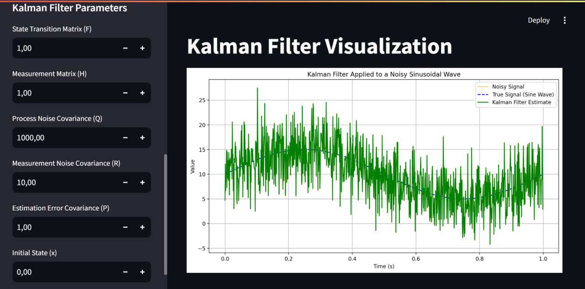
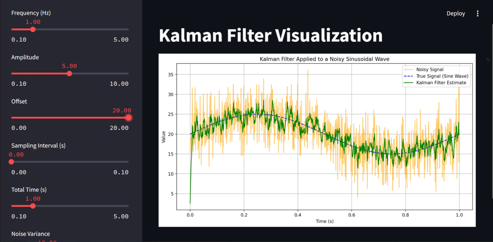

<h2>Початкові етапи дослідження фільтра Калмана</h2>

<p>Мета цього дослідження полягала у вивченні фільтра Калмана та його застосуванні для обробки шумних даних. Основними завданнями стали:</p>

<ul>
    <li>Знайомство з теорією фільтра Калмана та його застосуванням для фільтрації шуму у вимірюваннях.</li>
    <li>Аналіз параметрів фільтра та їх впливу на точність і стабільність згладжування.</li>
    <li>Дослідження ефектів різних параметрів на дисперсію шуму до та після фільтрації.</li>
</ul>

<h2>Програмний код</h2>

<p>Цей код створює інтерактивний додаток на основі Streamlit для візуалізації роботи Калман-фільтра. Код генерує зашумлений синусоїдальний сигнал і показує, як фільтр обробляє цей сигнал, відображаючи чистий сигнал, шум і оцінки фільтра.</p>

<p><strong>1. Імпорт бібліотек:</strong> використовується <code>NumPy</code> для обчислень, <code>Matplotlib</code> для побудови графіків і <code>Streamlit</code> для створення інтерфейсу веб-додатка.</p>

<p><strong>2. Інтерфейс Streamlit:</strong> код створює бічну панель із слайдерами, що дозволяють користувачу налаштовувати параметри сигналу (частота, амплітуда, зсув, інтервал дискретизації, тривалість) та параметри шуму і фільтра.</p>

<p><strong>3. Налаштування Калман-фільтра:</strong> клас <code>KalmanFilter</code> містить методи <code>predict</code> для прогнозування стану і <code>update</code> для оновлення оцінок на основі нових вимірювань. Це дозволяє фільтру зменшувати вплив шуму на сигнал.</p>

<p><strong>4. Генерація сигналу:</strong> синусоїдальний сигнал генерується з додаванням випадкового шуму. Всі параметри сигналу можна налаштувати через слайдери на панелі Streamlit.</p>

<p><strong>5. Застосування Калман-фільтра:</strong> на основі фільтрації зашумленого сигналу створюються оцінки для кожного кроку часу. Це дозволяє порівняти зашумлений сигнал, реальний сигнал і фільтровані оцінки.</p>

<p><strong>6. Візуалізація результатів:</strong> за допомогою <code>Matplotlib</code> будується графік, який показує три криві: зашумлений сигнал, істинний синусоїдальний сигнал і оцінки Калман-фільтра. Графік вбудовується в інтерфейс Streamlit, що дозволяє користувачу бачити оновлення в реальному часі.</p>

<p>Таким чином, користувач може взаємодіяти з параметрами сигналу та фільтра і спостерігати за змінами в роботі Калман-фільтра на різних наборах даних.</p>

``` python
import numpy as np
import matplotlib.pyplot as plt
import streamlit as st

# === Streamlit UI Setup ===
st.title("Kalman Filter Visualization")

# Signal parameters
frequency = st.sidebar.slider("Frequency (Hz)", 0.1, 5.0, 1.0)
amplitude = st.sidebar.slider("Amplitude", 0.1, 10.0, 5.0)
offset = st.sidebar.slider("Offset", 0.0, 20.0, 10.0)
sampling_interval = st.sidebar.slider("Sampling Interval (s)", 0.001, 0.1, 0.001)
total_time = st.sidebar.slider("Total Time (s)", 0.1, 5.0, 1.0)

# Noise parameters
noise_variance = st.sidebar.slider("Noise Variance", 1.0, 50.0, 16.0)
noise_std_dev = np.sqrt(noise_variance)

# Filter parameters
Q_value = st.sidebar.slider("Process Noise Covariance (Q)", 0.1, 10.0, 1.0)
R_value = st.sidebar.slider("Measurement Noise Covariance (R)", 0.1, 50.0, 10.0)
P_value = st.sidebar.slider("Initial Estimation Error Covariance (P)", 0.1, 10.0, 1.0)

# Kalman Filter Class
class KalmanFilter:
    def __init__(self, F, H, Q, R, P, x):
        self.F = F
        self.H = H
        self.Q = Q
        self.R = R
        self.P = P
        self.x = x

    def predict(self):
        self.x = np.dot(self.F, self.x)
        self.P = np.dot(self.F, np.dot(self.P, self.F.T)) + self.Q
        return self.x

    def update(self, z):
        K = np.dot(self.P, self.H.T) / (np.dot(self.H, np.dot(self.P, self.H.T)) + self.R)
        self.x = self.x + K * (z - np.dot(self.H, self.x))
        self.P = (np.eye(len(self.P)) - K * self.H) @ self.P
        return self.x

# Generate Signal
time_steps = np.arange(0, total_time, sampling_interval)
true_signal = offset + amplitude * np.sin(2 * np.pi * frequency * time_steps)
noisy_signal = [val + np.random.normal(0, noise_std_dev) for val in true_signal]

# Apply Kalman Filter
F = np.array([[1]])
H = np.array([[1]])
Q = np.array([[Q_value]])
R = np.array([[R_value]])
P = np.array([[P_value]])
x = np.array([[0]])

kf = KalmanFilter(F, H, Q, R, P, x)
kalman_estimates = []

for measurement in noisy_signal:
    kf.predict()
    estimate = kf.update(measurement)
    kalman_estimates.append(estimate[0][0])

# Plot Results
fig, ax = plt.subplots(figsize=(12, 6))
ax.plot(time_steps, noisy_signal, label='Noisy Signal', color='orange', linestyle='-', alpha=0.6)
ax.plot(time_steps, true_signal, label='True Signal (Sine Wave)', linestyle='--', color='blue')
ax.plot(time_steps, kalman_estimates, label='Kalman Filter Estimate', color='green')
ax.set_xlabel('Time (s)')
ax.set_ylabel('Value')
ax.set_title('Kalman Filter Applied to a Noisy Sinusoidal Wave')
ax.legend()
ax.grid()

# Display Plot
st.pyplot(fig)
```

<h2>Звіт: Дослідження впливу параметрів Калман-фільтра</h2>

<h3>1. Вплив Матриці коваріації шуму процесу (Q)</h3>
<p>Параметр <strong>Q</strong> визначає рівень довіри до моделі процесу. Підвищення значення Q сприяє більшій гнучкості фільтра, що дозволяє йому швидше реагувати на зміни сигналу, але може знизити стабільність, додаючи більше "коливань" у вихідні дані.</p>

<p align="center">
    
</p>
<p align="center">
    Низьке значення процесної коваріації шуму
</p>

<p align="center">
    
</p>
<p align="center">
    Високе значення процесної коваріації шуму
</p>

<h3>2. Вплив Матриці коваріації шуму вимірювання (R)</h3>
<p>Параметр <strong>R</strong> показує, наскільки сильно фільтр довіряє вимірюванням. При низькому значенні R фільтр дуже чутливий до шуму, оскільки сильно покладається на отримані вимірювання. При високих значеннях фільтр ігнорує шумні дані, використовуючи більше попередні оцінки.</p>

<p align="center">
    
</p>
<p align="center">
    Низьке значення коваріації шуму вимірювання
</p>

<p align="center">
    
</p>
<p align="center">
    Високе значення коваріації шуму вимірювання
</p>

<h3>3. Вплив Початкової матриці коваріації (P)</h3>
<p>Значення <strong>P</strong> визначає початкову невпевненість фільтра в своїй оцінці стану. Низьке значення P означає, що фільтр довіряє початковим значенням, що може знизити адаптивність на початкових етапах. Високі значення P, навпаки, підвищують гнучкість фільтра, дозволяючи йому швидше підлаштуватися до нових даних.</p>

<p align="center">
    
</p>
<p align="center">
    Низьке значення початкової матриці коваріації
</p>

<p align="center">
    
</p>
<p align="center">
    Високе значення початкової матриці коваріації
</p>

<h3>4. Вплив Початкової оцінки стану (Initial state estimate)</h3>
<p>Різні початкові оцінки стану дають змогу побачити, як фільтр адаптується. Якщо початковий стан близький до істинного значення, фільтр швидко стабілізується. При значному відхиленні початкового стану фільтр потребує більше часу для збіжності.</p>

<p align="center">
    
</p>
<p align="center">
    Початкова оцінка стану з близьким до реального значення
</p>

<p align="center">
    
</p>
<p align="center">
    Початкова оцінка стану з далеким від реального значення
</p>

<h3>5. Вплив Постійної складової сигналу (offset)</h3>
<p>Зміна <strong>offset</strong> дозволяє оцінити, як фільтр реагує на зміщення в сигналі. Зазвичай, якщо фільтр налаштований правильно, він швидко адаптується до нового рівня сигналу, незалежно від зсуву.</p>

<p align="center">
    
</p>
<p align="center">
    Високе значення зсуву сигналу
</p>

<h3>6. Вплив Загального часу моделювання (total_time)</h3>
<p>Чим довше триває моделювання, тим більше часу у фільтра на адаптацію. Для тривалих симуляцій фільтр досягає стабільних результатів, навіть якщо налаштований на згладжування короткострокових коливань.</p>

<p align="center">
    
</p>
<p align="center">
    Короткий час моделювання
</p>

<p align="center">
    
</p>
<p align="center">
    Довгий час моделювання
</p>

<p>Змінюючи ці параметри, можна зрозуміти, як Калман-фільтр адаптується до різних умов і вибрати оптимальні значення для конкретного випадку.</p>
